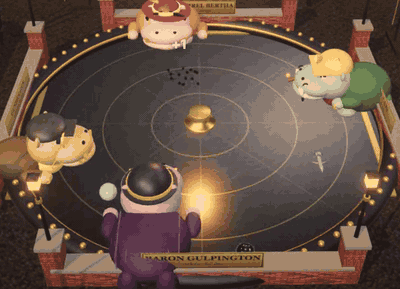
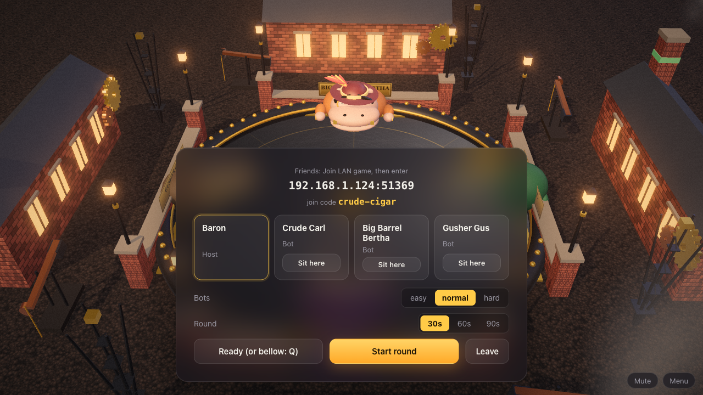
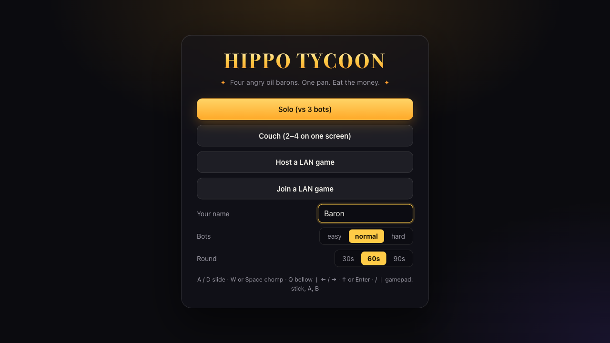
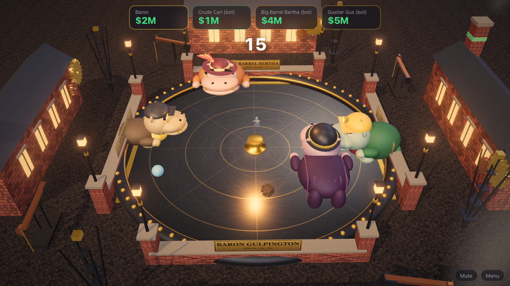
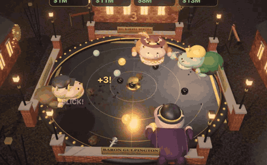
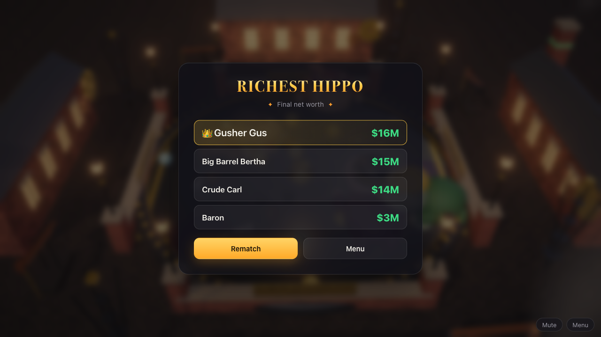
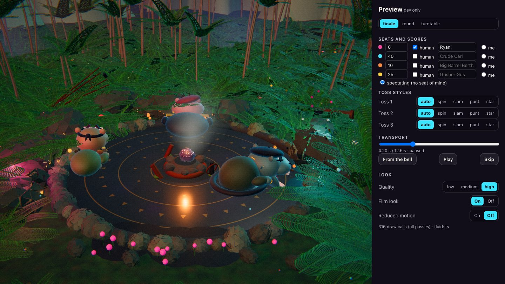
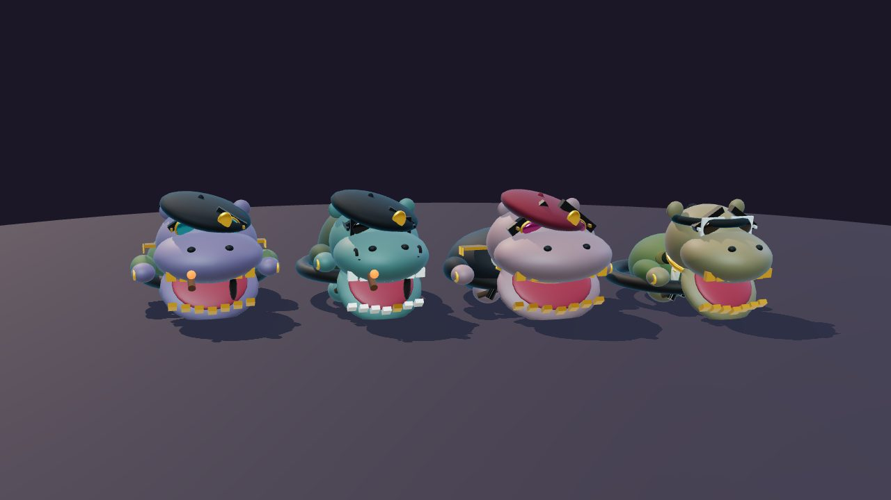

# Hippo Tycoon

> **What it proves:** one codebase, every way to play: solo, couch, LAN party and online rooms, with one game class running as a Durable Object on Cloudflare and in-process in the binary. One of the [Rusty Buns](../../README.md#see-it-work) examples; all of them are in [EXAMPLES.md](../../EXAMPLES.md).

Four angry, greedy oil-baron hippos around a lost oil geyser deep in the jungle (misty fluted peaks, lush ferns and palms, a rusted wellhead and a fallen derrick half swallowed by vines), each trying to chomp the most oil the geyser fires into the basin. Slide along your lip, time your chomp, and avoid the sludge. It plays solo against bots, on one couch, over a LAN, and online in a room code, and it is the example that shows the whole Rusty Buns story: one Cloudflare-first codebase that is also a desktop binary, with a LAN party mode.

The oil geyser's gush is a particle fluid simulation written in **Rust** (compiled to WebAssembly) with a TypeScript twin as the fallback; a test holds the two to bit-identical output.

The four bosses dress like guerrilla warlords at a Miami sunset: berets, bandoliers of oil vials, gold epaulettes and medals, mirrored shades, chains and cigars. (Vibe only; nothing from any film or show.)

Everything on screen is built in code: the hippos, the ruins, the palms and ferns, the mountains, the geyser and the drops are three.js primitives, the textures are drawn on a canvas at startup and the sounds are synthesised. There are no asset files.



## Run it

Run every command from the folder named in its step.

1. **Install** (repo root, once, and again after pulling):
   ```
   bun install
   ```
2. **Go to the app:**
   ```
   cd apps/hippo-tycoon
   ```

### Solo and couch, in the browser

```
bun run dev            # vite, hot reload: http://localhost:5173
```

### The Rust fluid (optional)

```
bun run build:native   # cargo + the wasm32 target -> public/hippo_fluid.wasm (needs rustup)
```

Without it the geyser runs the TypeScript twin (same output, a bit slower). The corner of the game says which one is running (`fluid: Rust/wasm`). The wasm is a build output and is not committed.

### The desktop app (solo, couch, and hosting a LAN game)

```
bun run desktop:dev    # = rustybuns build desktop --dev --check, then run desktop
bun run desktop:build  # one standalone binary: dist/hippo-tycoon-<os>-<arch> (about 63 MB)
```

The build type-checks the app first (`--check`; Bun 1.4.2 has no `bun check`, so it falls back to `tsc`).

### A LAN party



1. On one machine, launch the desktop app and choose **Host a LAN game**. The lobby shows `address:port` and a **join code**.
2. On the others, launch their own copy of the app (or open the dev server on `http://`) and choose **Join a LAN game**. Enter the address and the code.
3. The host picks bots (all at once, or one seat at a time with **Difficulty**) and round length and presses **Start round**. Empty seats are bots; a player who leaves hands their seat to a bot, keeping the score, and gets that seat back when they rejoin.

Two people can share one machine in a LAN or online game: set **Here (LAN/online)** to 2 players in the menu (A/D + W + Q and the arrows, or gamepads 1 and 2). One connection then drives two seats. A human who arrives when all four seats are taken watches, and can **Sit here** when a seat frees up.

Up to four guest connections: the host plus three guests (`guests: { max: 3 }`). There is no TLS, so this is for a network you trust. A guest's page must be served over `http://` (a desktop build or the dev server); a page served over `https://` cannot open the `ws://` connection. To try it on one machine, launch two copies of the binary and join with the host's LAN address.

### Online rooms (Cloudflare)

The Worker in `src/worker.ts` routes `/ws?room=ABCD` to one Durable Object per room. To run it locally with workerd (nothing is created in the cloud):

```
bun run build                              # the client, into dist/client
bunx wrangler dev --local --port 8787      # the Worker + Durable Object
bun scripts/smoke-online.ts http://127.0.0.1:8787     # a scripted two-player round
```

Open `http://127.0.0.1:8787` in two tabs, choose **Online room**, make a room in one, and type its code in the other.

Deploying is yours to run: `bunx rustybuns plan` (creates nothing), then `bunx rustybuns deploy`. `plan` needs a live Cloudflare login (`alchemy profile refresh`). The Alchemy and Effect versions Alchemy needs are pinned in the **repo root** `package.json` (`overrides`), because Bun ignores overrides inside a workspace member.

## Play

| Menu | A round |
|---|---|
|  |  |

| | Slide | Chomp | Bellow (ready) |
|---|---|---|---|
| Player 1 | <kbd>A</kbd> / <kbd>D</kbd> | <kbd>W</kbd> or <kbd>Space</kbd> | <kbd>Q</kbd> |
| Player 2 | <kbd>←</kbd> / <kbd>→</kbd> | <kbd>↑</kbd> or <kbd>Enter</kbd> | <kbd>/</kbd> |
| Gamepad | stick or d-pad | A | B |
| Touch | drag | tap | n/a |

Solo accepts both keyboard layouts. In **Couch**, pick who sits where; a gamepad joins when you press a button on it.

| Drop | Worth | What happens |
|---|---|---|
| Oil (a black ball) | +$1M | the common one |
| Premium gold (a faceted gem) | +$3M | rare, comes in bursts, faster; the other hippos snarl |
| Sludge (a brown, lumpy clod) | −$1M | you choke and cough smoke: no sliding or chomping for 1 s |
| Bolt (grey, spiky) | −$2M | sore jaw: half slide speed for 3 s |
| Water (a blue teardrop) | $0 | your next chomp is a dud: "watered down!" |

Every drop has its own shape as well as its own colour. Press <kbd>H</kbd> in a round (or **How to play** on the menu) for the controls and this legend on screen; it also shows itself for the countdown and the first seconds.

A gold drop nobody eats for 6 s splatters into a slick that makes nearby drops skate faster. A round is 30, 60 or 90 seconds; the drip rate ramps up and the last 10 seconds are **Overflow** (twice the drips, more gold, more bolts). The richest hippo wins; ties share. Then comes the **finale**: the winner straps on a championship belt, bellows, and wrestles the losers out of the basin one at a time, last place first (an airplane spin, a mud slam, a punt, and the runner-up launched at the stars), into the jungle. Every number is in `src/sim/rules.ts`.

| Overflow, then the podium | The podium |
|---|---|
|  |  |

### Options and accessibility

**Options** (on the menu, and in a round's corner) are saved in the browser with your name:

- **Reduced motion**: no screen shake, camera sway, countdown fly-in, finale camera moves, flailing or bouncing text. It follows the system's `prefers-reduced-motion` until you pick.
- **Film look**: the colour fringe, grain, scanline and vignette (the teal-and-pink grade stays).
- **Quality**: low / medium / high: shadows, bloom, how thick the jungle is, and how many droplets the geyser keeps in the air.
- **Sound**, **Music** (the synth pulse) and **Effects** (everything else), each on its own.

Menus, the lobby and the podium work from the keyboard (<kbd>Tab</kbd>, <kbd>Enter</kbd>, <kbd>Space</kbd>, <kbd>Esc</kbd> closes Options), with a visible focus ring; the score cards, podium and buttons are labelled for screen readers. `test/contrast.test.ts` checks the HUD, cards, buttons and popups against WCAG contrast.

### The dev preview page

`bun run dev`, then open [`/preview`](http://localhost:5173/preview) (or `?preview=finale`, `?preview=round`, `?preview=turntable`). It drives the real renderer without a round:

- **finale**: set each seat's score, human or bot, name and which seat is yours; pick each toss's style; play, pause, scrub and skip.
- **round**: pose each hippo (roar, snarl, sputter, sore, belt), fire the geyser (oil, gold, a big surge), show one of each drop.
- **turntable**: one hippo, or all four, at full size under studio light, turning.

Quality, film look and reduced motion switch live, and the page shows the frame's draw calls. Everything is in the URL too (see the top of `src/client/preview/Preview.tsx`), so a view can be linked or screenshotted. It only exists in dev: a production build leaves it out (`test/build.test.ts` checks).

| The finale, scrubbed to the grab | The turntable |
|---|---|
|  |  |

## How it is built

```
sim (rules, 30 Hz) ─▶ engine (Match: seats, phases, bots) ─▶ Driver seam ─┬─ LocalDriver: solo and couch, the Match runs in the page
                                                                          └─ NetDriver ──ws──▶ World (room-do.ts) ─┬─ Cloudflare: one Durable Object per room
                                                                                                                   └─ desktop binary: the same class in-process; the LAN host
```

```
src/sim/       the game: pure, deterministic, 30 Hz. No DOM, no clock, no Math.random (a test enforces it)
src/engine/    platform-free: Match (lobby > countdown > playing > podium, seats, bots), Room (sockets), tick loop, wire
src/client/    React UI, three.js renderer, input, audio, LocalDriver and NetDriver
src/client/render/fluid.ts   the geyser's fluid: the TypeScript twin + the wasm loader (rust/crates/hippo_fluid is the Rust)
src/room-do.ts the one World class: the Cloudflare Durable Object and the in-process desktop world
src/worker.ts  the Cloudflare entry: validates and vouches identity, routes rooms
```

- **One game, two homes.** `World` runs on Cloudflare as a Durable Object and, unchanged, inside the desktop binary where Rusty Buns binds it in-process. The LAN host is just that world with the `guests` door opened.
- **Server-authoritative.** Clients send inputs; the room steps at 30 Hz and sends snapshots at 15 Hz; the client draws two snapshots about 100 ms behind. Your own chomp animates the moment you press it, and the server still decides what was eaten.
- **The same match everywhere.** Solo and couch use the same `Match` the room runs, through `LocalDriver`, so a round plays the same wherever it runs. Bots are input-only drivers with their own seeded randomness, so who is a bot never changes which drops drip.
- **Persistence is deliberately small.** A room saves its phase, seats, scores and round seed when the phase or seats change, not as scores tick: a mid-round score means nothing without the drops and positions it came from. If the Durable Object is evicted mid-round, the round restarts from its countdown with the same seed and scores reset; the players still connected go back to the seats they held. Podium scores are saved at the podium. A storage alarm checks the tick loop every 10 s while anyone is seated and restarts it if it has stopped.
- **Abuse limits.** Each connection has a message budget (60 a second per seat it drives); a flood is closed (`4008`) and its seats go to bots. The Worker refuses a WebSocket upgrade from another site's page (`Origin`; localhost and LAN addresses are allowed for dev) and limits how many distinct rooms one address opens a minute (per Worker isolate).
- **Identity.** Online, the Worker validates the player id and name from the query, strips any client-sent `X-*` header and vouches its own. On a LAN, the Rusty Buns host vouches the identity. The world never trusts a message body.

## Tests

```
bun test test          # sim, bots, match, wire, room (fake ports), worker, input, the fluid (Rust == TypeScript), a real LAN party,
                       # the finale, settings and cues, contrast, and that a production build leaves the preview page out
```

`test/lan.test.ts` boots the generated Rusty Buns desktop host with this app's world, then plays a round with the host page and two LAN guests on real sockets.

## The build profile

`bunx rustybuns build desktop --check`, on Bun 1.4.2, macOS arm64:

```
profile: build desktop  (bun 1.4.2)
  boundary glue             7ms    0%
  typecheck app           1.65s   53%  [tsc]
  client build            1.32s   43%
  compile darwin-arm64    111ms    4%
  total                   3.09s
```

`build desktop --dev --check`: typecheck 2.70 s, client build 1.54 s, bundle dev host 12 ms, total 4.28 s. `rustybuns plan`: the generated stack type-checks in 3.09 s with tsc.
