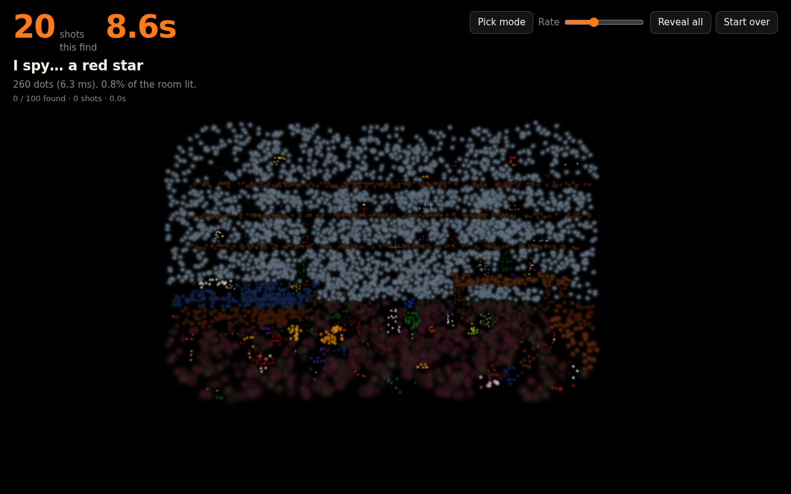
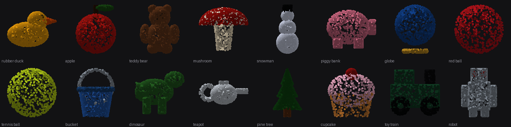

# Splat spy (prototype)

An I-spy game on Gaussian splats, in the spirit of *Scanner Sombre*. A kid's room holding **100 things** sits in total darkness. You hold a scanner: each shot throws a few hundred dots into the room, and wherever they land the real colours light up. The game asks for one thing ("I spy… a red crayon"), you scan until you spot it, then hold Shift and click it. A correct pick flies the camera in and dims everything else.

**Fewest shots wins, and time breaks ties.** Every round the room is dark again and everything has moved, so memorising the layout doesn't help.

Built with [Three.js](https://threejs.org), [Spark](https://github.com/sparkjsdev/spark) (World Labs' MIT-licensed splat renderer for Three.js) and [RustyBuns](../../README.md). More examples: [EXAMPLES.md](../../EXAMPLES.md).



## Run it

```
cd apps/splat-spray
bun install
bun run dev              # in the browser, with hot reload
bun run desktop:dev      # as the desktop app
bun test                 # spray math, gun cadence, room layout
```

- **Scan:** hold the left button. **Look:** right-drag or the arrow keys. **Pick:** hold Shift and click, or toggle **Pick mode**. In pick mode the cursor becomes a hand, the reticle turns into a green circle, the screen edge glows green and the banner changes, so the mode is never in doubt.
- **Next round:** Space, or the **Next** button.
- **Tuning:** **Rate** sets shots per second; `DOTS_PER_SHOT` and `SHOT_SPREAD_DEG` are at the top of `src/main.ts`; the scanner's spread and climb in `DEFAULT_GUN` (`src/gun.ts`); how long dots linger in `LOOK`, and the focus dimming in `FOCUS_DIM` (`src/reveal.ts`).

## How it works

**Generating the room instead of capturing it** is what makes the game possible: every splat is tagged with the object it belongs to, so each of the 100 things has a name, a splat range and a bounding box for free. That gives you the prompt list, the ability to light up one object, a way to check what the player pointed at, and shuffling: splats are stored relative to their object's origin, so moving everything between rounds is a position rewrite rather than a rebuild.

- **`src/levels/kit.ts`** samples splats onto shapes (sphere, box, cylinder, cone, torus, disc, wall). About 235,000 splats in total, with scenery at a fraction of the density of the small objects: a floor at object density is over a million splats by itself.
- **`src/levels/room.ts`** is the contents: 100 things, each drawn around a point, dealt into 134 slots across the floor, a bed, a desk, three shelves and a toy chest. Sixty-four are one-offs (duck, teddy, dinosaur, guitar, piggy bank…) and thirty-six are colour families, so prompts like "a blue block" need a second look. Add one by appending to `THINGS` or `MORE`.
- **`src/levels/scene.ts`** collects the splats, records each object's range and bounds, and **bakes the lighting**: splats carry no lighting of their own, so a plain colour makes everything a flat silhouette. Each splat is shaded by the direction its surface faces (`LIGHT`: one key light, a softer fill, ambient, and a little grain), which is what gives the objects form.
- **`src/spray.ts`** (CPU, once per shot) has both hit tests, over one pass of the splats:
  - **`scan()`** for shots: the cone's grid cells are the rays, and each ray lights the single nearest splat, which is what makes dots rather than paint.
  - **`spray()`** for picking: a solid narrow cone, where each splat blocks the area its blob covers, or the test would leak between points (there's a test for exactly that).
- **`src/reveal.ts`** (GPU, every frame) holds two lookup textures, one for "painted at" times and one for object ids. Fresh paint flashes, holds, then dims by colour. When an object is focused, everything else drops to `FOCUS_DIM`.
  - **Dim by colour, not opacity:** a surface is dozens of overlapping splats, and dozens of faint layers stack back up to solid.
- **`src/gun.ts`** is the firing cadence, driven by the render loop rather than a timer: a timer queues its missed callbacks during a stall and dumps them at once, which turned a one-second burst into 245 rounds in testing.
- **Picking** fires an invisible round and takes the object with the most hits in the cone, so you can only pick things you've actually painted.

A shot against 585,000 splats takes about 6–15 ms; a million splats takes about 15 ms on an M-series Mac. That's fine for clicks, and it's the loop to move to Rust when scenes get big.

## Checking the objects

`bun scripts/contact-sheet.ts /tmp/objects.json` dumps every object's splats as seen from the front, so all 100 can be checked at a glance without a GPU. That's how the first "star" was caught (five bars stacked in one place) and how five objects with faces lying flat (the clocks, the key, the magnifying glass, the sunglasses) were found: a disc drawn horizontally is invisible from the front. Run it after adding or changing a thing.



## Next steps

1. **More realism.** The lighting bake got objects most of the way; the rest is either more shape detail per object (bevels, thickness, wear) or real captured objects, which brings licensing, downloads and the problem that a capture has no object tags.
2. **Harder prompts.** Ask by description ("something you drink from") rather than by name.
3. **A second room.** The kit and slot layout are separate from the contents, so a garage or a kitchen is a new list of things.
4. **The Rust engine.** Move `spray()` into a crate with a spatial index and all cores, with the TypeScript version as fallback and a parity test (the `apps/tscircuit-desktop` recipe).
5. **Daily room.** One seed a day for everyone, scores as "found all 100 in 214 shots", with a web build on Cloudflare.

## Known limits

- **No automated browser test in the repo.** The loop was driven by hand in headless Chromium (paint, wrong pick, correct pick, focus, next). Software rendering there runs at about one frame per second, so the flash is hard to judge; check the feel on a real GPU.
- **Level of detail is off.** `lod: false` keeps splat indices stable for the paint and object textures. Big scenes will need Spark's level-of-detail support and a different per-splat lookup.
- **Flat things are hard to spot** (the pencil, the scissors, the key lie flat). That's arguably the game working as intended, but they may need stands.
- **Scoring is per round only.** Shots and time are tracked and the best round is shown, but there's no leaderboard or daily seed yet.
- **`__spy` on `globalThis`** is a debugging hook used during testing.

## License

Spark is MIT-licensed, © World Labs Technologies, Inc. Three.js is MIT-licensed.
