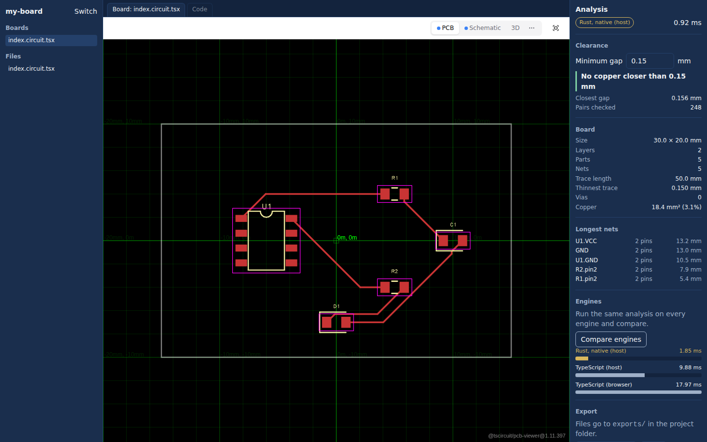

# tscircuit desktop

A desktop app for [tscircuit](https://tscircuit.com): one downloaded file, double-click, and you're editing boards. No Node, no Bun, no `npm install -g`. Built on [RustyBuns](../../README.md), with a Rust engine for the heavy work.



## What you get

- **Your folders, live.** Open any folder of `*.circuit.tsx` files, or create a starter project. Save in your own editor and the board re-renders.
- **tscircuit's own viewers.** PCB, schematic and 3D, from `@tscircuit/runframe`, with the evaluator bundled so boards render offline.
- **Board analysis in Rust.** Size, connectivity, unrouted nets, trace length per net and layer, copper area, and a clearance check of every trace against every other net's traces and pads. It re-runs on every render.
- **Fabrication files to disk.** Gerbers and drill files, BOM, pick-and-place and Circuit JSON, written to `exports/` in the project.

## Run it

```
bun install
bun native/build.ts                                   # the Rust engine (needs cargo)
bun ../../packages/cli/src/index.ts build desktop --dev
bun ../../packages/cli/src/index.ts run desktop       # opens a Chrome app window

bun ../../packages/cli/src/index.ts build desktop     # dist/tscircuit-desktop-<os>-<arch>
```

Outside this repo, `@rustybuns/cli` is a dev dependency and those become `bunx rustybuns build desktop`. `bun test` checks that the Rust and TypeScript engines agree. `bun scripts/bench.ts 5000` times them against each other.

The Rust engine is optional at every step. If it isn't built for a platform, the app says "using TypeScript" and gives the same answers, only slower.

## How it fits together

```
Chrome app window (built Vite + React UI)
  RunFrame ── tscircuit evaluator in a web worker ──► Circuit JSON
  Analysis panel ── POST /api/analyze ─┐       also: analysis worker (wasm or TS)
                                        ▼
Bun host (the binary)
  desktop/host.ts   files, watching, folder dialog, exports, analyze
  desktop/native.ts bun:ffi ──► libtsci_analysis (Rust, all cores)
                    └ falls back to src/analysis/analyze.ts
```

- `rustybuns.config.ts` is the whole wiring. `host` names the backend module, `native` embeds the Rust library in the binary, and `headers` relaxes cross-origin isolation so tscircuit's CDN models load.
- `native/crates/tsci_analysis` is the Rust engine. It exposes plain `extern "C"` functions, so the same code is both the native library and the `.wasm`.
- `src/analysis/analyze.ts` is its line-for-line TypeScript twin, and `tests/parity.test.ts` keeps them equal.

## Add your own Rust analysis

1. **Write the Rust.** Add a function to `native/crates/tsci_analysis/src/lib.rs` that takes the element slice and returns a `serde_json::Value`, then call it from `analyze()` so its output lands under a new key. Or add a new `#[no_mangle] extern "C"` function next to `tsci_analyze` if it needs its own inputs.
2. **Expose it.** If you added a new function, add it to `tsciSymbols` in `desktop/native.ts`, plus a route in `desktop/host.ts`.
3. **Show it.** Read the new key in `src/AnalysisPanel.tsx`, then run `bun native/build.ts` and rebuild.

Keep the TypeScript twin in step if you want the fallback to give the same answer. The parity test will tell you when it doesn't.

## In the browser too

`bun native/build.ts --wasm` also compiles the crate to `public/native/tsci_analysis.wasm`, single-threaded, and the analysis worker uses it when present. That needs `rustup target add wasm32-unknown-unknown`. **This path is written but has not been compiled or run yet.** Until then the worker uses the TypeScript twin, and the engine comparison labels it honestly.

## Known limits

- **Internet still needed for some things.** Boards that import `@tsci/*` registry packages, JLCPCB parts or 3D models still fetch them from tscircuit's servers. Everything else renders offline.
- **One OS per build.** The Rust library is per-OS, so each platform's binary is built on that OS (a CI matrix). The binary is about 110 MB, mostly the tscircuit toolchain.
- **Dependency workarounds.** `@tscircuit/runframe` imports packages it doesn't list, so they're listed in `package.json` here. Its Altium export is stubbed out because that package doesn't build outside tscircuit's repo. `circuit-json`, `@tscircuit/core`, `@tscircuit/props` and `zod@3` are pinned and deduped because tscircuit packages share them as peers.
- **Small editor.** The built-in editor is a plain text box with save. For real editing, use your own editor; the preview follows the files on disk.
