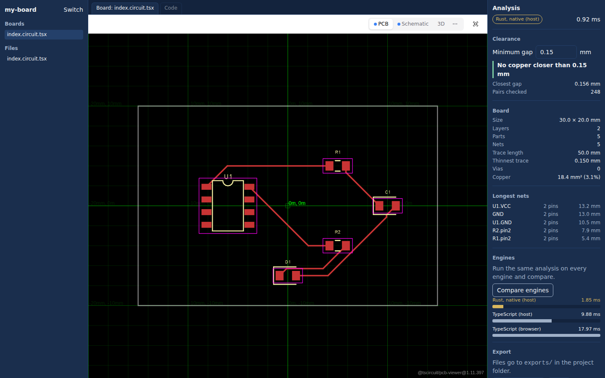

# tscircuit desktop app

[tscircuit](https://tscircuit.com) builds circuit boards with React, and its viewer and
evaluator are plain web libraries, which means... we can build a desktop app out of it with RustyBuns!

Open a folder of boards, see them live, check them, and export fabrication files.
tscircuit's own tools already do most of this, but you need Bun or Node and a global install first.

I wanted a path that was easier, extensible, flexible:
- one download
- nothing to install
- a Rust engine for the heavy processing work.

Well RustyBuns can do that!
[RustyBuns](../../README.md)... More examples: [EXAMPLES.md](../../EXAMPLES.md).





## You need Bun to build the binary BUT your users need NOTHING.

`rustybuns build desktop` produces one self-contained file: the UI, the backend, and **every engine**: native Rust, Rust compiled to WebAssembly, and TypeScript. No Node, no Bun, no `npm install -g`. Download, double-click, done.

The engines give identical results (`tests/parity.test.ts` checks equality, field by field):

- **Rust, native** runs in the backend on its own thread, spread across every core, so the app never stalls while a big board is checked. It's 2-5x faster than TypeScript.
- **Rust, wasm** is the same crate running in the browser.
- **TypeScript** runs anywhere and is the fallback for everything.

Click **Compare engines** in the app to watch all three run on your own board.

### Nice fallbacks if Rust engine fails

If the Rust engine is missing or fails to load, the app says so, and switches to the TypeScript engine with the same results. Nothing crashes.

Each binary carries the Rust library for its own OS (the macOS arm64 download has the macOS arm64 library). To build without Rust, remove `native: ["tsci_analysis"]` from `rustybuns.config.ts`. You get a TypeScript-only binary.

## Features

- **Your folders, live.** Open any folder of `*.circuit.tsx` files with the system folder picker, or create a starter project. Save in your own editor and the board re-renders.
- **tscircuit's own viewers.** PCB, schematic and 3D from `@tscircuit/runframe`, with the evaluator bundled so boards render offline.
- **Board analysis.** Size, connectivity, unrouted nets, trace length per net and layer, copper area, and a clearance check of every trace against every other net's traces and pads, reported by net name ("GND ↔ VCC, 0.08 mm"). It re-runs on every render.
- **Fabrication files to disk.** Gerbers and drill files (plus a `gerbers.zip` ready for a fab's upload form), BOM, pick-and-place and Circuit JSON, written to `exports/` in the project, one click from Finder or Explorer.

## Benchmarks

Clearance check plus analysis on a synthetic board, Apple M1 Pro (8 cores), Bun 1.4.2. Times include parsing the Circuit JSON:

| Traces  | JSON    | TypeScript | Rust wasm | Rust native | Native speedup |
|--------:|--------:|-----------:|----------:|------------:|---------------:|
| 1,000   | 0.3 MB  | 14 ms      | 15 ms     | 3 ms        | 5.4x           |
| 5,000   | 1.6 MB  | 43 ms      | 41 ms     | 13 ms       | 3.2x           |
| 20,000  | 6.4 MB  | 111 ms     | 112 ms    | 52 ms       | 2.1x           |
| 100,000 | 32.3 MB | 630 ms     | 625 ms    | 277 ms      | 2.3x           |

Reproduce with `bun scripts/bench.ts <traces>` (add `--brute` for the no-index "before").

**The algorithm came first.** The first version compared every trace with every other net's copper. On 20,000 traces that took 44.6 s in TypeScript and 3.8 s in Rust on all cores. Both engines now put copper in a grid and only measure pairs that could be close: the same board takes 111 ms and 52 ms, and the app shows "pairs measured: X of Y" so you can see the work skipped. The index is exact, not a heuristic. Its search radius starts at 1 mm and grows until the closest gap is provably the closest on the board, and the tests check it against brute force on randomized boards.

**What Rust adds after that.** All cores, typed zero-copy parsing (the first Rust version spent more time building a generic JSON tree than analyzing it), and no garbage collector. The wasm build runs on one thread and copies its input in, so in the browser it ties with the JS engine. Its value is one codebase, not speed.

## Build it yourself

You need [Bun](https://bun.sh) 1.4+ and [Rust](https://rustup.rs). `rustybuns.config.ts` lists `tsci_analysis` under `native`, so `rustybuns build desktop` stops with `native crate(s) not built: tsci_analysis` until you run `bun native/build.ts`.

```
git clone https://github.com/QuinnsCode/RustyBuns
cd RustyBuns && bun install
cd apps/tscircuit-desktop
bun native/build.ts          # required: the Rust engine (and the wasm one, if the target is installed)
bun run desktop:dev          # builds the UI (a minute or two) and opens the app
bun run desktop:build        # the single file: dist/tscircuit-desktop-<os>-<arch>
```

- **First run on macOS:** the binary is unsigned, so macOS blocks it the first time. Right-click → Open, or run `xattr -d com.apple.quarantine <file>`.
- **Browser:** the app opens in Chrome, Edge or Brave as an app window when one is installed, and in your default browser otherwise.
- **Wasm:** `rustup target add wasm32-unknown-unknown` once, and `bun native/build.ts` builds `public/native/tsci_analysis.wasm` for the browser too.
- **Tests:** `bun test` checks that every engine agrees and that the index matches brute force. The Rust tests skip, with a message, until the engine is built.

## How it fits together

```
App window (built Vite + React UI)
  RunFrame ── tscircuit evaluator in a web worker ──► Circuit JSON
  Analysis panel ── POST /api/analyze ─┐     also: in-browser worker
                                        │       tsci_analysis.wasm (Rust), else TypeScript
                                        ▼
Bun host (the binary)
  desktop/host.ts    files, watching, folder picker, exports, analyze
  desktop/native.ts  bun:ffi ──► libtsci_analysis (Rust, own thread, all cores)
                     │            └ done(id, result) ──► JSCallback (threadsafe) ──► event loop
                     └ falls back to src/analysis/analyze.ts
```

| File | Role |
|------|------|
| `rustybuns.config.ts` | All the wiring. `host` names the backend module, `native` embeds the Rust library, `headers` lets tscircuit's CDN models load. |
| `native/crates/tsci_analysis` | The Rust engine: plain `extern "C"` functions, callable through bun:ffi and compilable to wasm. `src/parse.rs` reads Circuit JSON into typed, borrowed fields. |
| `src/analysis/analyze.ts` | The TypeScript engine, a line-for-line twin of the Rust, spatial index included. |
| `src/analysis/wasm.ts` | Calls the wasm build: shared by the browser worker and the tests. |
| `tests/parity.test.ts` | Keeps every engine equal, and the index equal to brute force. |

## Add your own Rust analysis

1. **Write the Rust.** Add a function to `native/crates/tsci_analysis/src/lib.rs` that takes the element slice and returns a `serde_json::Value`, and call it from `analyze()` so its result lands under a new key. If it reads a Circuit JSON field nothing reads yet, add that field to `Element` in `src/parse.rs`.
2. **Match it in TypeScript.** Add the same logic to `src/analysis/analyze.ts` so the fallback gives the same answer. The parity test tells you when it doesn't.
3. **Show it.** Read the new key in `src/AnalysisPanel.tsx`, run `bun native/build.ts`, and rebuild.

Need different inputs? Add a new `#[no_mangle] extern "C"` function next to `tsci_analyze`, list it in `tsciSymbols` in `desktop/native.ts`, and add a route in `desktop/host.ts`. For anything slow, copy the `tsci_analyze_async` pattern: Rust copies the input, works on its own thread, and calls a thread-safe `JSCallback` when it's done, so the host keeps serving in the meantime.

## Known limits

- **Wasm is single-threaded.** Rust in the browser runs on one core (no rayon), so it ties with the JS engine. Threads in wasm would need `SharedArrayBuffer` and a wasm thread pool; the app is already cross-origin isolated, so this is possible but not done.
- **Some things still need the internet.** Boards that import `@tsci/*` registry packages, JLCPCB parts or 3D models fetch them from tscircuit's servers. Everything else works offline.
- **One OS per build.** The Rust library is built per OS, so each platform's binary is built on that platform (a CI matrix for releases). A binary is about 110 MB, mostly the tscircuit toolchain.
- **Dependency workarounds.** `@tscircuit/runframe` imports packages it doesn't declare, so they're listed in `package.json` here. Its Altium export is stubbed because that package doesn't build outside tscircuit's repo. `circuit-json`, `@tscircuit/core`, `@tscircuit/props` and `zod@3` are pinned and deduplicated, since tscircuit packages share them. The UI build needs an 8 GB heap setting, as in runframe's own build.
- **Small editor.** The built-in editor is a plain text box with save. Use your own editor for real work; the app follows the files on disk, and the built-in editor warns you instead of overwriting when a file changes underneath it.

## Licenses

Every build writes `THIRD_PARTY_LICENSES.txt` from what the binary actually contains:

- **UI:** the npm packages in the Vite bundle, including dependencies baked into prebuilt bundles like tscircuit's evaluator.
- **Host:** the export libraries the Bun backend imports.
- **Native:** the Rust crates linked into the engine.
- **Runtime:** Bun itself.

The file is embedded in the binary (linked from the welcome screen, served at `/THIRD_PARTY_LICENSES.txt`) and written to `dist/`, so you can publish it next to the downloads.

- `bun run licenses` gives a quick estimate without building.
- `LICENSES_STRICT=1 bun run build` fails the build if any component needs review. Use it in CI.
- Many tscircuit packages don't declare a license in their npm package. `licenses/overrides.json` records the ones verified against the LICENSE file in their GitHub repo, with a link for each. Re-check those when versions change.

**Before distributing, review what the build lists under "review before distributing":**

- **tscircuit packages with no license found.** The tscircuit project is MIT, but these packages don't say so. Ask the maintainers to confirm and add `license` fields.
- **`@tsci/tscircuit.ti*`**, Texas Instruments parts libraries. Check whether the part data carries its own terms.
- **`@resvg/resvg-js`** (MPL-2.0). File-level copyleft: fine to ship unmodified with its notice.
- **`occt-import-js`** (LGPL-2.1), the STEP/CAD importer inside tscircuit's evaluator. LGPL has obligations for bundled code. Decide how to meet them, or whether you need it, before you ship.
